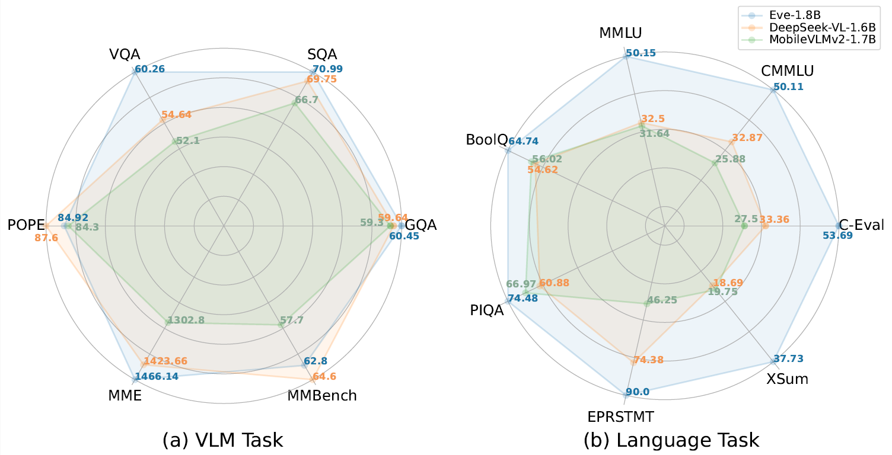
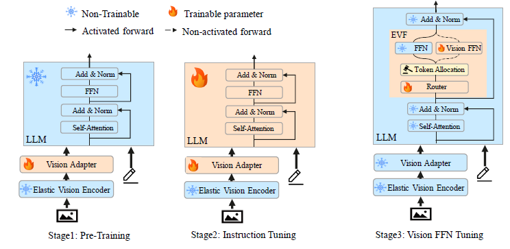

<h2 align="center"> <a href="https://arxiv.org/pdf/2501.04322">   Eve: Efficient Multimodal Vision Language Models with Elastic Visual Experts</a></h2>

## Abstract
Multimodal vision language models (VLMs) have made significant progress with the support of continuously increasing model sizes and data volumes. Running VLMs on edge devices has become a challenge for their widespread application. There are several efficient VLM efforts, but they often sacrifice linguistic capabilities to enhance multimodal abilities, or require extensive training. To address this quandary, we introduce the innovative framework of Efficient Vision Language Models with Elastic Visual Experts (Eve). By strategically incorporating adaptable visual expertise at multiple stages of training, Eve strikes a balance between preserving linguistic abilities and augmenting multimodal capabilities. This balanced approach results in a versatile model with only 1.7B parameters that delivers significant improvements in both multimodal and linguistic tasks. Notably, in configurations below 3B parameters, Eve distinctly outperforms in language benchmarks and achieves state-of-the-art results 68.87% in VLM Benchmarks. Additionally, its multimodal accuracy outstrips that of the larger 7B LLaVA-1.5 model.

### 😮 Highlights

Eve shows excellent performance in VLM task and Language task.

#### 🔥 High performance in VLM and Language task, but with fewer parameters
- with only **1.8B  parameters** that delivers significant improvements in both multimodal and linguistic tasks.

## Methods
Our proposed model, Eve, incorporates a sophisticated three-stage framework, strategically integrating elastic vision experts at each stage. A key focus of our approach is the preservation of linguistic capabilities throughout the training process. Notably, the linguistic proficiency of the model remains unaffected by the variations in pre-training data used for the visual encoder during the first two stages of training. This stability in linguistic performance is a significant accomplishment, as it ensures that the model’s ability to process and comprehend language is not compromised by changes in the visual encoder’s pretraining.

